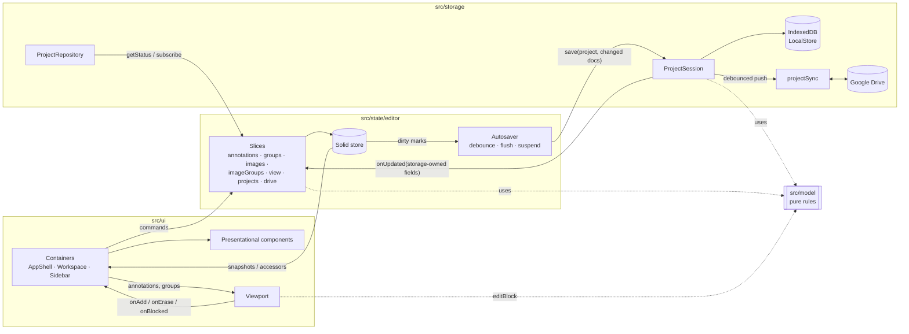

# Architecture

A browser-only SolidJS + TypeScript app. There is no server: the browser's
IndexedDB holds the working copy of every project, and a project can also be
linked to a Google Drive folder (the folder *is* the project). This page names
the modules, the seams between them and how data flows.

## Modules

| Folder | Role | Depends on |
| --- | --- | --- |
| `src/model` | Data contract (`types.ts`, schema v1) and pure domain rules: edit policy (`policy.ts`), annotation ops, counts and the one `isConfirmed` (`annotations.ts`), groups (`groups.ts`), image order, documents and the storage-owned merge (`project.ts`), tools and their keys (`tool.ts`). No Solid, no I/O. | nothing |
| `src/storage` | Persistence behind a framework-free contract (`api.ts`): IndexedDB working copy (`localStore.ts`), local version history (`versionHistory.ts`, pure rules in `versions.ts`), codecs (zip, CSV, validation, image decode), Google Drive (`drive/`: HTTP client, auth session, picker, pure sync engine `sync.ts`, per-project orchestration `projectSync.ts`, status + autosave scheduler). | model |
| `src/state` | The editor: one Solid store split into slices (`editor/`), debounced autosave, undo history, messages, repository choice. Adapts storage's `subscribe` to signals. | model, storage contract |
| `src/detection` | Colony detector (pure TS) and its module Worker + typed client. Framework-free; imports model types only. | model (types) |
| `src/state/assist` | Assisted counting ("Find similar"): pure review rules (`review.ts`: suggestion layer, derived pending view, accept plan), seed selection (`seeds.ts`) and the controller (`index.ts`) owning one detector client and the in-memory suggestion store. | model, detection contract, editor |
| `src/state/region` | Region selection (Region tool): the controller (`index.ts`) keeping one in-memory polygon per image, counts inside it, clear in region, find similar in region (through assist) and the detector comparison (`compare.ts`, pure: seed choice, request, matching via `detection/match.ts`, export JSON). Pure geometry is `model/region.ts`. | model, detection contract, editor, assist |
| `src/viewport` | Canvas viewport: rendering, gestures, pen/touch policy, spatial index. A pure view: it reports intents (`onAdd`, `onErase`, `onBlocked`) and never edits data. | model |
| `src/ui` | Containers (`AppShell`, `WorkspaceContainer`, `SidebarContainer`, `VersionHistoryContainer`, `createProjectActions`) wire editor slices to presentational components (app bar, sidebar, toolbar, workspace, primitives). CSS lives next to each feature. | state, viewport, model |
| `src/demo` | In-memory demo repository + sample plates. Loaded with a dynamic import only for `?demoStorage` or when real storage cannot start, so it is a separate chunk. | model, storage codecs |

`App.tsx` is the composition root: it chooses the repository, creates the editor,
toaster, dialogs, thumbnail cache and project actions once, and provides them via
`AppContext` to containers only.

## Seams

**Storage contract (`src/storage/api.ts`).** `ProjectRepository` lists, creates,
opens, imports and deletes projects and exposes `getStatus()`, `getDriveState()`
and `subscribe()`. Opening returns a `ProjectSession`: the only way to touch a
project (`save`, `images.*`, `exportZip/Csv`, `drive.link/push/takeRemote`,
`onUpdated`). One session is open at a time; opening another closes the previous
one and its methods then reject. Drive actions start Google sign-in synchronously
so Safari allows the popup.

**Storage-owned fields.** Storage owns `project.storage`, `revision` and each
image's `source` / `sourceMismatch`. The editor
never writes them; `session.save` keeps storage's values and `session.onUpdated`
reports changes, which the editor merges with `applyStorageOwned`
(`src/model/project.ts`, also used by the repository). Linking to Drive therefore
never reloads the project, so edits made during the first upload survive.

**Removing an image is a soft delete.** `images.remove` sets
`ImageRecord.deletedAt` (an editor-owned edit saved with `project.json`) and
`images.restore` clears it. Storage has no remove operation and never erases image
bytes, annotation documents or Drive files. `model/project.ts` (`displayOrder`,
`imagesInGroup`, `activeImages`, `removedImages`) is the one place that hides
removed images from lists, navigation, counts and the CSV.

**Version history (local snapshots).** `session.history` (`VersionHistory` in
`api.ts`) lists, creates, loads, restores and deletes versions of the open project:
`project.json` plus every annotation document, never image bytes. The IndexedDB
implementation (`storage/versionHistory.ts`) stores deflated JSON parts keyed by content
hash (unchanged documents are shared between versions) and runs inside the repository
lock, so a version requested before a save captures the state before it. Pure rules
(counts, retention, quota relief, the restored working copy) are in `storage/versions.ts`;
`storage/memoryHistory.ts` is the same contract in memory (demo repository, editor tests).
A restore first stores a `before-restore` version, then writes the version with
storage-owned fields kept and, when linked, marks everything pending for Drive. Quota
errors remove the oldest automatic versions and retry; a version failure never changes
the save status. Layout and retention: `docs/schema.md`.

The editor's `versions` slice (`state/editor/versions.ts`) takes automatic versions (the
state as opened, before the first change of a session; then every 10 minutes while there
are changes), "Save version now", whole-project restore (reloads the project like taking
the Drive version) and per-image restore (one undoable `applyBatch` on that image).

**`editor.versions.beforeDestructive(label)` — the hook for destructive changes.** Call
and await it right before any change that removes or replaces annotations in bulk, then
apply the change:

```ts
const saved = await editor.versions.beforeDestructive('Before clearing “Colonies” in the selected region')
if (!saved.ok && isBulk) { /* ask: refuse, or "… anyway" with an extra confirm */ }
editor.annotations.applyBatch(imageId, ops, { label: 'Clear in region' })
```

- It flushes pending edits, then stores a `before-destructive` version of the saved
  state labelled `label` ("Before …", shown in Version history and its list).
- Edits are frozen (`state.busy`, blocking) while it runs; it usually takes well under
  100 ms.
- It never throws. It resolves `{ ok: true, version }` or `{ ok: false, reason }`
  (`reason` is user-facing: storage full, local save failed, …).
- The caller decides what a failure means. Changes that undo cannot fully reverse (clear
  a group on all images, delete a group) are refused unless the user confirms "… anyway";
  a one-image change that is one undo step may go ahead.
- After a successful bulk change, mention it in the toast: `VERSION_SAVED_DETAIL`
  ("A version was saved — restore it from Version history.") with a
  `Version history` action (`actions.showVersionHistory`, `ui/projectActions.ts`).

Wired today: clear a group (this image / all images), delete a group with annotations,
take the Drive version. Accepting assisted batches is not destructive and takes no
version. Importing a `.zip` always creates a new project, so it needs none.

**Drive bookkeeping** (output file IDs and the md5 last read/written per file, for
conflict checks) lives in the local `SyncState`, not in the model.

**Editor slices (`src/state/editor/`).** `annotations`, `groups`, `images`,
`imageGroups`, `view`, `projects`, `drive` share one store through
`EditorContext`. Each exposes commands plus its own derived accessors (e.g.
`annotations.current()`, `groups.list()`). Containers take only the slices they
use. Store arrays are replaced, never mutated, so `unwrap`ped snapshots change
identity exactly when content changes.

**Viewport contract (`src/viewport/api.ts`).** `annotations` and `groups` are
immutable snapshots; the viewport redraws and re-indexes on identity change.
Refusals use the shared edit policy: `editBlock(group)` returns
`'no-group' | 'locked' | 'hidden'` (locked before hidden), plus the viewport-only
`'nothing-to-erase'` and `'touch-navigates'` (a finger tap in Add/Erase while touch
annotation is off; the UI offers to turn it on). `onAdd(x, y, { nearAnnotationId })`
reports an add on top of an existing visible marker: the add still happens, the
viewport pulses both markers and the UI offers Undo. Marker size is a screen-space
radius; far zoomed out (scale < 0.5) the displayed radius shrinks smoothly to a
3.5 px minimum (`viewport/marker-size.ts`), and number labels are placed around
their marker to avoid collisions (`viewport/label-layout.ts`).

`adjust` (an `ImageDisplayAdjust`, compared by value) and `compareOriginal` change
only the image layer: `viewport/adjusted-layer.ts` caches display-adjusted copies of
the pyramid, computed lazily by `adjust.worker.ts` (OffscreenCanvas; chunked
main-thread fallback in `adjust-processor.ts`) with the pure LUT/matrix maths in
`viewport/image-adjust.ts` (the centre-contrast colour LUT and its eyedropper
helpers in `viewport/centre-contrast.ts`; DOM sampling of original pixels in
`viewport/eyedropper.ts`). The viewport's `pickMode`/`onPick` turns the next tap,
click or Enter into an image point for the eyedropper instead of an annotation
intent. Markers are never filtered. The settings live on
`ImageRecord.display` and are set with `images.setDisplay` (project.json only, not
undoable, allowed while a group is locked).

**Assisted counting.** `createAssist` (composition root, `AppServices.assist`) keeps
one suggestion layer per image in memory. Layers are never in annotation documents,
history, autosave or counts; they are dropped on project switch, when the image's
bytes change (`sourceMismatch`/fingerprint) or the target group is deleted. What is
pending is derived from the layer plus the current annotations: a suggestion is
hidden once any annotation covers it (0.7 r), and a cluster is resolved while
annotations carrying one of the layer's accept run ids exist, so undo brings the
suggestions back. Every accept is ONE `annotations.applyBatch(imageId, ops,
{ label, detectionRun })` with a fresh run id (so undo removes exactly that run).
The run carries `imageFingerprint`, `seedImageFingerprints` (reference plate) and
`negatives` (rejected suggestions in scope). Rejections no stored accept run records
(e.g. "Reject all") go into one reject-only run per layer, written with
`annotations.setRunRecord` outside undo history and kept in step with the layer as
the user rejects and restores. Negatives never filter later runs. A result that
arrives after an accept made during its run is discarded and the search runs again.
Taking the Drive version (or any reload, `state.loadCount`) drops all layers. The worker client is created on the
first run, cancelled on image switch, new run and panel close, and its cache is
cleared on image switch. The viewport gets read-only `suggestions`,
`reviewClusters` and `onSuggestionTap` (taps on a ring toggle rejection only while
the review panel is open; elsewhere Add/Erase act on confirmed markers) and
`ViewportHandle.showRect` for region navigation.

**Region selection.** The Region tool (`Tool = 'region'`, key R; a trailing toolbar
item after Find similar, in More / the tool switcher when narrow) draws a selection.
The viewport's gesture machine has a `lasso` mode: a drag by the primary mouse
button, the Pencil or ONE finger (also with touch annotation off; fingers still only
navigate while a pen was used in the last 10 s) emits `lassoStart`/`lassoMove`/
`lassoEnd`; a second finger, a pen landing, `pointercancel` or Escape emit
`lassoCancel` (the second finger then pinches). A press without movement stays a tap
(suggestion rings). The viewport closes and simplifies the path with
`model/region.ts` `finishRegion` (RDP at 1.5 screen px, ≤ 400 points, clamped, image
px; Shift or the bar's Rectangle option draws a rectangle; regions under 16 screen px
are refused via `onRegionTooSmall`) and reports `onRegion(polygon)`. It never calls
`onAdd`/`onErase`. `region` (dashed outline, outside dimmed, SVG overlay) and
`compareMarks` (canvas) are read-only props. `createRegion` (`AppServices.region`)
keeps regions in memory only (never saved, never in undo history; dropped on project
switch or reload). "Clear N in region" removes the active group's annotations whose
centre is inside as ONE `applyBatch` after `editor.versions.beforeDestructive` (a
failed version does not block it: it is one undo step on one image); locked/hidden
groups are refused through `annotations.explainGroupBlock` (feedback `refused`).
"Find similar in region" calls `assist.start({ roi })`; the request carries
`roi: {kind:'polygon'}`, which the run record (and so accepted batches) keeps. The
comparison uses the assist controller's detector client (`assist.detector()`): only
one detection runs at a time, so starting a comparison closes the review panel and a
Find similar run cancels a comparison.

**Polygon ROI in the detector.** `detection/roi.ts` still finds the plate; with a
polygon the analysed mask is the plate interior inside the polygon grown by a context
band (4 % of the plate diameter), so clusters cut by the edge are fitted whole, and
`detect()` keeps suggestions whose centre lies inside the polygon. Existing
annotations anywhere on the image stay fixed colonies, so nothing marked outside is
suggested again at the edge. Calibration (seed measurement, noise) uses the plate
interior (`RoiResult.inner`), so examples outside the region work.

**Edit feedback (sound cues).** The editor and the assist controller take an
optional `feedback` port (`state/feedback.ts`) and report what happened to the
user's edit: `added` (with `near` when the viewport reported a marker underneath),
`erased`, `history` (undo/redo), `accepted` (assisted batch) and `refused` (every
explained refusal: hidden/locked/no group, nothing to erase, edits paused, refused
undo/redo or accept). The composition root also reports every toast as `notice`.
The pure `cueFor` maps events to cues (error toasts and refusals share the error
cue; a finger tap that only navigates is silent so palm contact never buzzes).
`ui/sound` filters by the per-device `SoundSettings` (`state/soundSettings.ts`,
localStorage), drops the same cue repeated within 45 ms (a refusal and its toast)
and synthesises it with Web Audio (`engine.ts`, recipes as data in `cues.ts`). The
AudioContext is created on the first gesture (iOS rule) and resumed after
'suspended'/'interrupted'; Web Audio on iOS stays in the ambient session, so Silent
mode mutes it. The gear in the app bar (`appbar/SettingsMenu.tsx`) edits these
settings and the device's touch-annotates preference.

## Data flow



1. A tap in the viewport becomes `annotations.add(x, y)`. The slice checks the
   edit policy, applies one undoable batch to the store and marks the document
   dirty.
2. The autosaver waits 400 ms, then calls `session.save(project, changedDocs)`.
   The repository writes IndexedDB, keeps storage-owned fields and, if the project
   is linked, marks it pending and schedules a Drive push 4 s later.
3. The push snapshots edit counters, uploads changed documents, `summary.csv` and
   `project.json` (last), checkpoints file IDs into the local sync state and reports
   new image sources through `onUpdated`.
4. Status changes (`saved-local`, `pending`, `saving-drive`, `conflict`, ...) reach
   the UI through `repo.subscribe` → editor signals → the save pill.

## Operations that replace the project

Opening another project, importing a `.zip`, opening a Drive folder, taking the
Drive version and restoring a version first flush the autosaver. If that save fails the user is asked
before anything is discarded. While such an operation runs, `state.busy.blocking`
is set: edits are refused with a notice, the UI shows a scrim, and taking the Drive
version or restoring a version also suspends the autosaver until the new state is loaded.

## Testing

Pure modules (`model`, viewport geometry and interaction, storage codecs, the Drive
sync engine against an in-memory fake Drive, autosave, history) have unit tests.
The repository is tested against `fake-indexeddb` and the fake Drive; the editor
against a mock repository/session. Run `npx vitest run` and `npx tsc -b`.
