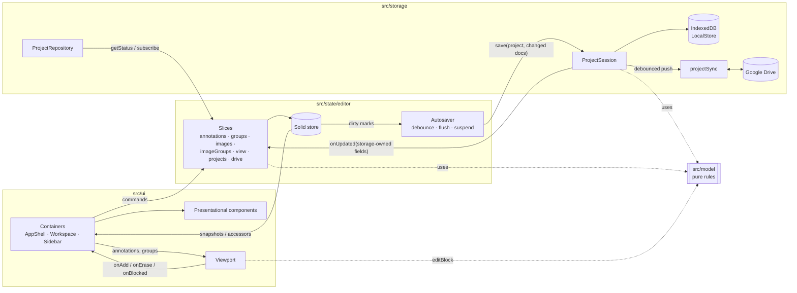

# Architecture

A browser-only SolidJS + TypeScript app. There is no server: the browser's
IndexedDB holds the working copy of every project, and a project can also be
linked to a Google Drive folder (the folder *is* the project). This page names
the modules, the seams between them and how data flows.

## Modules

| Folder | Role | Depends on |
| --- | --- | --- |
| `src/model` | Data contract (`types.ts`, schema v1) and pure domain rules: edit policy (`policy.ts`), annotation ops, counts and the one `isConfirmed` (`annotations.ts`), groups (`groups.ts`), image order, documents and the storage-owned merge (`project.ts`), tools and their keys (`tool.ts`). No Solid, no I/O. | nothing |
| `src/storage` | Persistence behind a framework-free contract (`api.ts`): IndexedDB working copy (`localStore.ts`), codecs (zip, CSV, validation, image decode), Google Drive (`drive/`: HTTP client, auth session, picker, pure sync engine `sync.ts`, per-project orchestration `projectSync.ts`, status + autosave scheduler). | model |
| `src/state` | The editor: one Solid store split into slices (`editor/`), debounced autosave, undo history, messages, repository choice. Adapts storage's `subscribe` to signals. | model, storage contract |
| `src/viewport` | Canvas viewport: rendering, gestures, pen/touch policy, spatial index. A pure view: it reports intents (`onAdd`, `onErase`, `onBlocked`) and never edits data. | model |
| `src/ui` | Containers (`AppShell`, `WorkspaceContainer`, `SidebarContainer`, `createProjectActions`) wire editor slices to presentational components (app bar, sidebar, toolbar, workspace, primitives). CSS lives next to each feature. | state, viewport, model |
| `src/demo` | In-memory demo repository + sample plates. Loaded with a dynamic import only for `?demoStorage` or when real storage cannot start, so it is a separate chunk. | model, storage codecs |

`App.tsx` is the composition root: it chooses the repository, creates the editor,
toaster, dialogs, thumbnail cache and project actions once, and provides them via
`AppContext` to containers only.

## Seams

**Storage contract (`src/storage/api.ts`).** `ProjectRepository` lists, creates,
opens, imports and deletes projects and exposes `getStatus()`, `getDriveState()`
and `subscribe()`. Opening returns a `ProjectSession`: the only way to touch a
project (`save`, `images.*`, `exportZip/Csv`, `drive.link/push/takeRemote`,
`onUpdated`). One session is open at a time; opening another closes the previous
one and its methods then reject. Drive actions start Google sign-in synchronously
so Safari allows the popup.

**Storage-owned fields.** Storage owns `project.storage`, `revision`,
`excludedDriveFileIds` and each image's `source` / `sourceMismatch`. The editor
never writes them; `session.save` keeps storage's values and `session.onUpdated`
reports changes, which the editor merges with `applyStorageOwned`
(`src/model/project.ts`, also used by the repository). Linking to Drive therefore
never reloads the project, so edits made during the first upload survive.

**Drive bookkeeping** (output file IDs and the md5 last read/written per file, for
conflict checks) lives in the local `SyncState`, not in the model.

**Editor slices (`src/state/editor/`).** `annotations`, `groups`, `images`,
`imageGroups`, `view`, `projects`, `drive` share one store through
`EditorContext`. Each exposes commands plus its own derived accessors (e.g.
`annotations.current()`, `groups.list()`). Containers take only the slices they
use. Store arrays are replaced, never mutated, so `unwrap`ped snapshots change
identity exactly when content changes.

**Viewport contract (`src/viewport/api.ts`).** `annotations` and `groups` are
immutable snapshots; the viewport redraws and re-indexes on identity change.
Refusals use the shared edit policy: `editBlock(group)` returns
`'no-group' | 'locked' | 'hidden'` (locked before hidden), plus the viewport-only
`'nothing-to-erase'`.

## Data flow

1. A tap in the viewport becomes `annotations.add(x, y)`. The slice checks the
   edit policy, applies one undoable batch to the store and marks the document
   dirty.
2. The autosaver waits 400 ms, then calls `session.save(project, changedDocs)`.
   The repository writes IndexedDB, keeps storage-owned fields and, if the project
   is linked, marks it pending and schedules a Drive push 4 s later.
3. The push snapshots edit counters, uploads changed documents, `summary.csv` and
   `project.json` (last), checkpoints file IDs into the local sync state and reports
   new image sources through `onUpdated`.
4. Status changes (`saved-local`, `pending`, `saving-drive`, `conflict`, ...) reach
   the UI through `repo.subscribe` → editor signals → the save pill.

## Operations that replace the project

Opening another project, importing a `.zip`, opening a Drive folder and taking the
Drive version first flush the autosaver. If that save fails the user is asked
before anything is discarded. While such an operation runs, `state.busy.blocking`
is set: edits are refused with a notice, the UI shows a scrim, and taking the Drive
version also suspends the autosaver until the new state is loaded.

## Testing

Pure modules (`model`, viewport geometry and interaction, storage codecs, the Drive
sync engine against an in-memory fake Drive, autosave, history) have unit tests.
The repository is tested against `fake-indexeddb` and the fake Drive; the editor
against a mock repository/session. Run `npx vitest run` and `npx tsc -b`.
